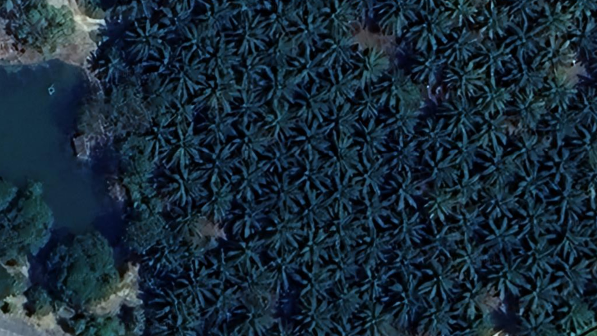
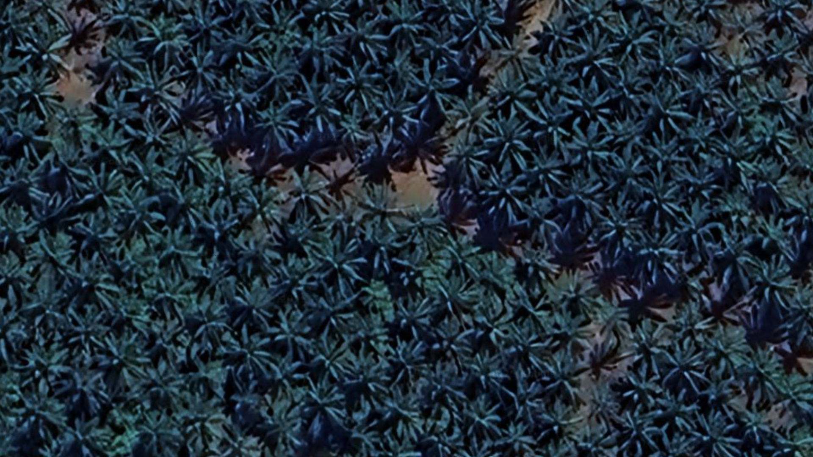

# PalmOilDetectree2
Palm Oil Tree Canopy Coverage Detection from Google Earth Satellite Imagery with [Detectree2](https://github.com/PatBall1/detectree2)


## Palm oil trees in Malaysia dataset for detectree2

- CRS is EPSG:32647 - WGS84 / UTM Zone 47N
- RGB is Google Earth image of 1920 x 1080 resolution taken at 10m scale. (2D mode)
- Monitor of PC when taking screenshot is 2560 x 1440 (16:9)

| Folder Name | Lat Lon | Imagery from the dates (from Google Earth) | Feature Size |
|-------------|---------|---------------------------------| ------------------------ |
| IskandarPuteri_Site1 | 1°26'46"N 103°37'39"E | 6/5/2023 | 94
| IskandarPuteri_Site2 | 1°26'36"N 103°37'23"E | 6/5/2023 | 59
| IskandarPuteri_Site3 | 1°26'27"N 103°37'39"E | 6/5/2023 | 92
| IskandarPuteri_Site4 | 1°26'44"N 103°37'46"E | 6/5/2023 | 115
| IskandarPuteri_Site5 | 1°26'39"N 103°37'44"E | 6/5/2023 | 150
| ZenxinKluang_Site1 | 1°57'18"N 103°12'49"E | 2/5/2024 | 56
| ZenxinKluang_Site2 | 1°57'23"N 103°12'46"E | 2/5/2024 | 65
| ZenxinKluang_Site3 | 1°57'19"N 103°12'53"E | 2/5/2024 | 164
| ZenxinKluang_Site4 | 1°57'26"N 103°12'41"E | 2/5/2024 | 220
| ZenxinKluang_Site5 | 1°57'38"N 103°12'59"E | 2/5/2024 | 157

- Only 1 class of mature palm oil tress currently. 
- For multiclass: Add your own class for young palm oil tree or other palm based trees such as coconuts or red dates. 

## Get started

We will be using python venv and jupyter notebook.

```
python -m venv .venv
source .venv/bin/activate
```

Afterwards follow the instructions in the [notebooks](./notebook/).
Scripts are based on the following [tutorial](https://patball1.github.io/detectree2/tutorial.html).


## Prediction on wild

| Original | Prediction | Filtered |
|----------|------------|----------|
|  |  |  |
|  |  |  |